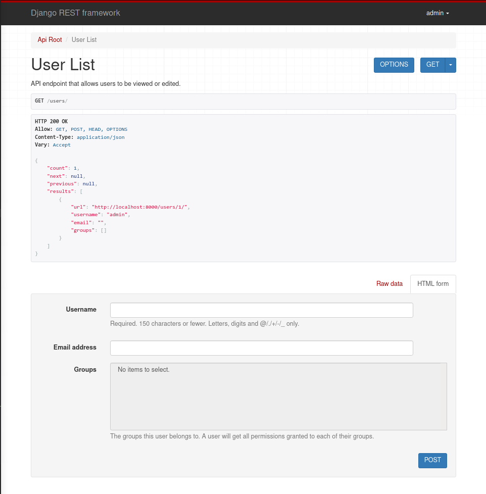

- [Quickstart](#quickstart)
  - [Preparation](#preparation)
    - [Serializers](#serializers)
    - [Views](#views)
    - [URLs](#urls)
      - [Routers](#routers)
    - [Pagination](#pagination)
    - [Settings](#settings)
    - [Project directory](#project-directory)
  - [Runtime](#runtime)
    - [Using CLI](#using-cli)
    - [Using a browser](#using-a-browser)
- [Serialization](#serialization)
  - [Getting Started](#getting-started)
  - [Model](#model)
  - [Creating a Serializer class](#creating-a-serializer-class)
  - [Working with Serializers](#working-with-serializers)
  - [Using `ModelSerializer`](#using-modelserializer)
  - [Writing regular Django views using Serializers](#writing-regular-django-views-using-serializers)
  - [Runtime](#runtime-1)
- [Requests and Responses](#requests-and-responses)
  - [Request objects](#request-objects)
  - [Response objects](#response-objects)
  - [Status codes](#status-codes)
  - [Wrapping API Views](#wrapping-api-views)
  - [Pulling it all together](#pulling-it-all-together)
  - [Adding optional format suffixes to URLs](#adding-optional-format-suffixes-to-urls)
    - [Calling the API view with format suffix patterns](#calling-the-api-view-with-format-suffix-patterns)
      - [Using `Accept` Header](#using-accept-header)
      - [Using url suffix](#using-url-suffix)
      - [Send requests](#send-requests)
    - [Browsability](#browsability)
- [Class-based Views](#class-based-views)
  - [Using Mixins](#using-mixins)
  - [Using generic class-based views](#using-generic-class-based-views)
- [Authentication and Permissions](#authentication-and-permissions)
  - [Prepare the Model](#prepare-the-model)
    - [Snippet Model](#snippet-model)
  - [Adding endpoints for our User models](#adding-endpoints-for-our-user-models)
  - [Associating Snippets with Users](#associating-snippets-with-users)
  - [Updating serializer](#updating-serializer)
  - [Adding required permissions to views](#adding-required-permissions-to-views)
  - [Adding login the Browseable API](#adding-login-the-browseable-api)
  - [Object level permission](#object-level-permission)
  - [Authenticating with the API](#authenticating-with-the-api)
- [Relationships & Hyperlinked APIs](#relationships--hyperlinked-apis)
  - [Creating an endpoint for the root of our API](#creating-an-endpoint-for-the-root-of-our-api)
  - [Creating an endpoint for the highlighted snippets](#creating-an-endpoint-for-the-highlighted-snippets)
  - [Hyperlinking our API](#hyperlinking-our-api)
  - [Making sure our URL patterns are named](#making-sure-our-url-patterns-are-named)
  - [Pagination](#pagination-1)
- [ViewSets & Routers](#viewsets--routers)
  - [Refactor to use `ViewSets`](#refactor-to-use-viewsets)
  - [Binding ViewSets to URLs explicitly](#binding-viewsets-to-urls-explicitly)
    - [Under the hood - Without Router](#under-the-hood---without-router)
    - [Using Routers](#using-routers)
    - [Trade-offs between views and viewsets](#trade-offs-between-views-and-viewsets)

# Quickstart 

## Preparation
### Serializers

Serializers allow complex data, e.g querysets and model instances to be convereted to native Python datatypes, which then can be easily rendered into `JSON` or `XML` or other content types. Serializers also provide deserialization, allowing parsed data to be converted back into complex types, after first validating the input.

The serializers in REST framework work very similarly to Django's `Form` and `ModelForm` classes. Their DRF counterparts are `Serializer` class which we can use to control the output of our responses as well as a `ModelSerializer` class which we can utilize to deal with model instances and querysets.

We are learning about this by defining a two serializer classes in `tutorial/quickstart/models.py`:

```python
from django.contrib.auth.models import User, Group
from rest_framework import serializers


class UserSerializer(serializers.HyperlinkedModelSerializer):
    class Meta:
        model = User
        fields = ['url', 'username', 'email', 'groups']


class GroupSerializer(serializers.HyperlinkedModelSerializer):
    class Meta:
        model = Group
        fields = ['url', 'name']
```

Why `HyperlinkedModelSerializer`? Dealing with relationships between entities is a challenging aspect of Web API design. There are a number of different ways that we can choose to represent a relationship:
- Using PK
- Using hyperlinking between entities
- Using a unique identifying slug field on the related entity
- Using a default string representation of the related entity
- Nesting the related entity inside the parent representation
- Some other custom representation

In this case we are using a hyperlinked style between entities by extending the `HyperlinkedModelSerializer` class instead of the existing default `ModelSerializer`. The `HyperlinkedModelSerializer` class has the following differences from `ModelSerializer`:
- It does not inlude the `id` field by default.
- It includes `url` field, using `HyperlinkedIdentityField`.
- Relationships use `HyperlinkedRelatedField`, instead of `PrimaryKeyRelatedField`.

### Views

Rather than writing multiple views, we are grouping together all the common behaviour into classes called `ViewSets`. Using viewsets keep the view logic nicely organized as well as being very concise.

**project/quickstart/views.py**
```python
from django.contrib.auth.models import User, Group
from rest_framework import viewsets
from rest_framework import permissions
from project.quickstart.serializers import UserSerializer, GroupSerializer


class UserViewSet(viewsets.ModelViewSet):
    '''

    API endpoint that allows users to be viewed or edited.

    '''
    queryset = User.objects.all().order_by('-date_joined')
    serializer_class = UserSerializer
    permission_classes = [permissions.IsAuthenticated]

class GroupViewSet(viewsets.ModelViewSet):
    '''

    API endpoint that allows groups to be viewed or edited.

    '''
    queryset = Group.objects.all()
    serializer_class = GroupSerializer
    permission_classes = [permissions.IsAuthenticated]
```

### URLs

**project/urls.py**
```python
from django.urls import include, path
from rest_framework import routers
from project.quickstart import views

router = routers.DefaultRouter()
router.register(r'users', views.UserViewSet)
router.register(r'groups', views.GroupViewSet)

urlpatterns = [
    path('', include(router.urls)),
    path('api-auth/', include('rest_framework.urls', namespace='rest_framework'))
]
```

Because we are using viewsets instead of views, we can automatically generate URL conf for our API by **registering the viewsets with a router class**.

Finally we are including a default login and logout views for use with the browseable API. This is optional but useful if our API requires authentication and we want to use a browseable API.

#### Routers

Resource routing allows us to quickly declare all of the common routes for a given resourceful controller. Instead of declaring seperate routes, a resourceful route declares them in a single line of code. 

Routers in DRF helps with automatic URL routing to Django and provide us with a simple, quick and consistent way of wiring our view logic to a set of URLs.

This is a simple example:
```python
from rest_framework import routers

router = routers.SimpleRouter()
router.register(r'users', UserViewSet)
router.register(r'accounts', AccountViewSet)
urlpatterns = router.urls
```

There are two mandatory arguments to the `register()` method:
- `prefix` - The URL prefix to use for this set of routes.
- `viewset` - The viewset class.

We can also declare an additional argument:
- `basename` - The base to use for the URL names that are created. If unset, the basename will be automatically generated based on the `queryset` attribute of the viewset, if it has one. If the viewset does not include a `queryset`, we **have to** set the the `basename` when registering the viewset to the router.

With the example above, the following URL patterns would be generated:
- `^users/$` - Name: `'user-list'`.
- `^users/{pk}/$` - Name: `'user-detail'`
- `^accounts/$` - Name: `'account-list'`
- `^accounts/{pk}/$` - Name: `'account-detail'`

The `basename` argument is used to specify the initial part of the view name pattern. In the above example that is `user` or `account`.

Typically the `basename` argument is needed where we have defined a custom `get_queryset` method. In this case the viewset may have a missing `queryset` attribute. If we would then try register that viewset with a router, we'd see this error:
```
'basename' argument not specified, and could not automatically determine the name from the viewset, as it does not have a '.queryset' attribute.
```

### Pagination

Pagination allows us to control how many objects per page are returned. To enable this, we add the following lines to `tutorial/settings.py`:

```python
REST_FRAMEWORK = {
    'DEFAULT_PAGINATION_CLASS': 'rest_framework.pagination.PageNumberPagination',
    'PAGE_SIZE': 10,
}
```

### Settings

Of course we also need to add `'rest_framework'` to `INSTALLED_APPS`.

### Project directory

```
../tutorial
├── db.sqlite3
├── manage.py
└── project
    ├── asgi.py
    ├── __init__.py
    ├── __pycache__
    │   ├── __init__.cpython-39.pyc
    │   ├── settings.cpython-39.pyc
    │   ├── urls.cpython-39.pyc
    │   └── wsgi.cpython-39.pyc
    ├── quickstart
    │   ├── admin.py
    │   ├── apps.py
    │   ├── __init__.py
    │   ├── migrations
    │   ├── models.py
    │   ├── __pycache__
    │   ├── serializers.py
    │   ├── tests.py
    │   ├── urls.py
    │   └── views.py
    ├── settings.py
    ├── urls.py
    └── wsgi.py

```

## Runtime

```sh
python manage.py runserver
```

We can now access our API.

### Using CLI

Using `curl`:
```sh
curl -H 'Accept: application/json; indent=4' -u admin:password http://localhost:8000/users/
```

```
{
    "count": 1,
    "next": null,
    "previous": null,
    "results": [
        {
            "url": "http://localhost:8000/users/1/",
            "username": "admin",
            "email": "",
            "groups": []
        }
    ]
}%  
```

.. or `httpie`:
```sh
http -a admin:password http://127.0.0.1:8000/users/
```
```
HTTP/1.1 200 OK
Allow: GET, POST, HEAD, OPTIONS
Content-Length: 134
Content-Type: application/json
Date: Tue, 20 Jul 2021 08:31:43 GMT
Referrer-Policy: same-origin
Server: WSGIServer/0.2 CPython/3.9.5
Vary: Accept, Cookie
X-Content-Type-Options: nosniff
X-Frame-Options: DENY

{
    "count": 1,
    "next": null,
    "previous": null,
    "results": [
        {
            "email": "",
            "groups": [],
            "url": "http://127.0.0.1:8000/users/1/",
            "username": "admin"
        }
    ]
}


```

### Using a browser

A nice template with a **Login** button is readily generated:


After we log in, we can now both view and edit on the same page:



# Serialization

This tutorial covers creating a simple pastebin code highlighting Web API.

## Getting Started

```sh
pip install pygments
mkdir serialization
django-admin startproject project serialization/
cd serialization
python manage.py startapp snippets
```

```python
INSTALLED_APPS = [
    ...
    'rest_framework',
    'snippets.apps.SnippetsConfig'
]
```

## Model

For the purpose of this learning exercise we'll start by creating a simple `Snippet` model that is used to store code snippets.

**serialization/snippets/models.py**
```python
from django.db import models
from pygments.lexers import get_all_lexers
from pygments.styles import get_all_styles

LEXERS = [i for i in get_all_lexers() if i[1]]
LANGUAGE_CHOICES = sorted([(i[1][0], i[0]) for i in LEXERS])
STYLE_CHOICES = sorted([(i, i) for i in get_all_styles()])

class Snippet(models.Model):
    created = models.DateTimeField(auto_now_add=True)
    title = models.CharField(max_length=100, blank=True, null=True, default='')
    code = models.TextField()
    linenos = models.BooleanField(default=False)
    language = models.CharField(choices=LANGUAGE_CHOICES, default='python', max_length=100)
    style = models.CharField(choices=STYLE_CHOICES, default='friendly', max_length=100)

    class Meta:
        ordering = ['created']
```

## Creating a Serializer class

The first thing we need to get started is to declare our serializers. These help us serializing and deserializing the snippet instances into nice representations such as `json`.

**snippets/serializers.py**
```python
from rest_framework import serializers
from .models import Snippet, LANGUAGE_CHOICES, STYLE_CHOICES


class SnippetSerializer(serializers.Serializer):
    id = serializers.IntegerField(read_only=True)
    title = serializers.CharField(required=False, allow_blank=True, max_length=100)
    code = serializers.CharField(style={'base_template': 'textarea.html'})
    linenos = serializers.BooleanField(required=False)
    language = serializers.ChoiceField(choices=LANGUAGE_CHOICES, default='python')
    style = serializers.ChoiceField(choices=STYLE_CHOICES, default='friendly')

    def create(self, validated_data):
        '''

        Create and return a new Snippet instance, given the validated data.

        '''
        return Snippet.objects.create(**validated_data)

    
    def update(self, instance, validated_data):
        '''

        Update and return an existing Snippet instance, given the validated data.

        '''
        instance.title = validated_data.get('title', instance.title)
        instance.code = validated_data.get('code', instance.title)
        instance.linenos = validated_data.get('linenos', instance.linenos)
        instance.language = validated_data.get('language', instance.language)
        instance.style = validated_data.get('style', instance.style)
        instance.save()

        return instance
```

The first part of the serializer class defines the fields that get serialized/deserialized. The `create()` and `update()` methods define how fully fledged instances are created or modified when calling `serializer.save()`.

A `serializer` instance is very similar to a Django `Form` instance and includes similar validation flags on various fields such as `required`, `max_length` and `default`.

The field flags can also control how the serializer should be displayed in certain circumstances, such as when rendering to HTML. The `{'base_template': 'textarea.html'}` flag is equivalent to using `widget=widgets.Textarea` on a Django's `Form` instance. This is particularly useful for controlling how the browsable API should be displayed.

We can also save ourselves some time by using the `ModelSerializer`. However, for the purpose of this tutorial we will keep our serializer definition explicit.

## Working with Serializers

Before we go any further, we can get familiar with the `SnippetSerializer` class in Django shell.

First, we create two snippets

```python
from snippets.models import Snippet
from snippets.serializers import SnippetSerializer
from rest_framework.renderers import JSONRenderer
from rest_framework.parsers import JSONParser

snippet = Snippet(code='foo = "bar"\n')
snippet.save()

snippet = Snippet(code='print("hello, world")\n')
snippet.save()
```

We can then look at serializing those instances

```python
for snippet in Snippet.objects.all():
    serializer = SnippetSerializer(snippet)
    print(serializer.data)
```
```
{'id': 1, 'title': '', 'code': 'foo = "bar"\n', 'linenos': False, 'language': 'python', 'style': 'friendly'}
{'id': 2, 'title': '', 'code': 'print("hello, world")\n', 'linenos': False, 'language': 'python', 'style': 'friendly'}
```

What we have done is translating the model instance into Python native data type. We can also render the data into `json`:

```py
for snippet in Snippet.objects.all():
    serializer = SnippetSerializer(snippet)
    json_content = JSONRenderer().render(serializer.data)
    print(json_content)
```
```
b'{"id":1,"title":"","code":"foo = \\"bar\\"\\n","linenos":false,"language":"python","style":"friendly"}'
b'{"id":2,"title":"","code":"print(\\"hello, world\\")\\n","linenos":false,"language":"python","style":"friendly"}'
```

Deserialization is similar:
```python
from snippets.models import Snippet
from snippets.serializers import SnippetSerializer
from rest_framework.renderers import JSONRenderer
from rest_framework.parsers import JSONParser
import io

snippet = Snippet.objects.get(pk=2)
serializer = SnippetSerializer(snippet)
json_content = JSONRenderer().render(serializer.data)

# First we parse a stream into Python native datatypes
stream = io.BytesIO(json_content) # <_io.BytesIO object>
data = JSONParser().parse(stream) # <'dict' object>

# ..then we restore those native datatypes into a fully populated object instance
serializer = SnippetSerializer(data=data)
print(serializer.is_valid())
print(serializer.validated_data)
```
```
True
OrderedDict([('title', ''), ('code', 'print("hello, world")'), ('linenos', False), ('language', 'python'), ('style', 'friendly')])
```

We can then save the parsed data:
```python
serializer.save()
```

We can also serializer querysets instead of model instances. To do so we simply add `many=True` flag to the serializer arguments
```python
serialized = SnippetSerializer(Snippet.objects.all(), many=True)
print(serialized.data)
```
```
[OrderedDict([('id', 1), ('title', ''), ('code', 'foo = "bar"\n'), ('linenos', False), ('language', 'python'), ('style', 'friendly')]), OrderedDict([('id', 2), ('title', ''), ('code', 'print("hello, world")\n'), ('linenos', False), ('language', 'python'), ('style', 'friendly')]), OrderedDict([('id', 3), ('title', ''), ('code', 'print("hello, world")'), ('linenos', False), ('language', 'python'), ('style', 'friendly')])]
```

## Using `ModelSerializer`

Right now, our `SnippetSerializer` class is replicating a lot of information that is also contained in the `Snippet` model class.

In the same way that Django has both `Form` and `ModelForm`, DRF also includes both `Serializer` classes and `ModelSerializer` classes.

We can refactor our code like so:

**BEFORE**
```python
from rest_framework import serializers
from .models import Snippet, LANGUAGE_CHOICES, STYLE_CHOICES


class SnippetSerializer(serializers.Serializer):
    id = serializers.IntegerField(read_only=True)
    title = serializers.CharField(required=False, allow_blank=True, max_length=100)
    code = serializers.CharField(style={'base_template': 'textarea.html'})
    linenos = serializers.BooleanField(required=False)
    language = serializers.ChoiceField(choices=LANGUAGE_CHOICES, default='python')
    style = serializers.ChoiceField(choices=STYLE_CHOICES, default='friendly')

    def create(self, validated_data):
        '''

        Create and return a new Snippet instance, given the validated data.

        '''
        return Snippet.objects.create(**validated_data)

    
    def update(self, instance, validated_data):
        '''

        Update and return an existing Snippet instance, given the validated data.

        '''
        instance.title = validated_data.get('title', instance.title)
        instance.code = validated_data.get('code', instance.title)
        instance.linenos = validated_data.get('linenos', instance.linenos)
        instance.language = validated_data.get('language', instance.language)
        instance.style = validated_data.get('style', instance.style)
        instance.save()

        return instance
```

**AFTER**
```python
from rest_framework import serializers
from .models import Snippet, LANGUAGE_CHOICES, STYLE_CHOICES


class SnippetSerializer(serializers.ModelSerializer):
    class Meta:
        model = Snippet
        fields = ['id', 'title', 'code', 'linenos', 'language', 'style']
```

We can also inspect all the fields in a serializer instance by printing its representation.

```python
serializer = SnippetSerializer()
print(repr(serializer))
```
```
SnippetSerializer():
    id = IntegerField(label='ID', read_only=True)
    title = CharField(allow_blank=True, allow_null=True, max_length=100, required=False)
    code = CharField(style={'base_template': 'textarea.html'})
    linenos = BooleanField(required=False)
    language = ChoiceField(choices=[('abap', 'ABAP'), ('abnf', 'ABNF'), ...], required=False)
```

The `ModelSerializer` class is simply a shortcut to create serializer object. It offers:
- An automatically determined set of field, from the model object
- Simple default implementations for the `create()` and `update()` methods.

## Writing regular Django views using Serializers

For this exercise we will not be using any of DRF's other features but simply write the views as regular Django views.

**snippets/views.py**
```python
from django.http import HttpResponse, JsonResponse
from django.views.decorators.csrf import csrf_exempt
from rest_framework.parsers import JSONParser
from .models import Snippet
from .serializers import SnippetSerializer


@csrf_exempt
def snippet_list(request):
    '''

    List all snippets or create new snippet.

    '''
    if request.method == 'GET':
        snippets = Snippet.objects.all()
        serializer = SnippetSerializer(snippets, many=True)
        return JsonResponse(serializer.data, safe=False)
    elif request.method == 'POST':
        data = JSONParser().parse(request)
        serializer = SnippetSerializer(data=data)
        if serializer.is_valid():
            serializer.save()
            return JsonResponse(serializer.data, status=201)
        else:
            return JsonResponse(serializer.errors, status=400)


@csrf_exempt
def snippet_detail(request, pk):
    '''

    Retrieve, update or delete a code snippet.

    '''
    try: 
        snippet = Snippet.objects.get(pk=pk)
    except Snippet.DoesNotExist:
        return HttpResponse(status=404)
    
    if request.method == 'GET':
        serializer = SnippetSerializer(snippet)
        return JsonResponse(serializer.data)
    elif request.method == 'PUT':
        data = JSONParser().parse(request)
        serializer = SnippetSerializer(snippet, data=data)
        if serializer.is_valid():
            serializer.save()
            return JsonResponse(serializer.data)
        return JsonResponse(serializer.data, status=400)

    elif request.method == 'DELETE':
        snippet.delete()
        return HttpResponse(status=204)
```

Because we want to be able to POST to this view from clients that won't have a CSRF token, we need to mark the view as `csrf_exempt`. This isn't something that we normally want to do, and DRF views use more sensible behaviour than this, however this is just an example.

Then we need to wire the two views above with a route in **snippets/urls.py**:

**Note:** At this stage we also haven't dont anything to deal with a POST request that contains a malformed `json`, or if a request is made of anything that cannot be handled by the view. If any of this happens we will end up with a 500 Server Error response.

## Runtime

```python
python manage.py runserver
```

We can now test our view using `httpie`:

```sh
http http://127.0.0.1:8000/snippets/2
```

```
HTTP/1.1 200 OK
Content-Length: 120
Content-Type: application/json
Date: Tue, 20 Jul 2021 12:26:00 GMT
Referrer-Policy: same-origin
Server: WSGIServer/0.2 CPython/3.9.5
X-Content-Type-Options: nosniff
X-Frame-Options: DENY

{
    "code": "print(\"hello, world\")\n",
    "id": 2,
    "language": "python",
    "linenos": false,
    "style": "friendly",
    "title": ""
}
```

# Requests and Responses

## Request objects

DRF introduces a `Request` object that extends the regular `HttpRequest`, and provides more flexible request parsing.

The core functionality of a `Request` object is the `request.data` attribute, which is similar to `request.POST` but more useful for working with Web APIs.

The `request.data` handles arbitrary data. It works for `POST`, `PUT` and `PATCH` methods. A `request.POST` only handles form data and works for `POST` methods.

## Response objects

DRF also introduces a `Response` object, which is a type of `TemplateResponse` that takes unrendered content and uses content negotiation to determine the correct content type to return to the client.

```python
return Response(data)
```

## Status codes

Although we can use numeric HTTP status codes in our views, they aren't made for obvious reading and it is not easy to get an error code wrong. DRF provides more explicit identifiers for each status code, such as `HTTP_400_BAD_REQUEST` in the `status` module. It is a good idea to use these.

## Wrapping API Views

DRF provides two wrappers that we can use to write API views.

1. The `@api_view` decorator for working with function based views.
2. The `APIView` class for working with class-based view.

These wrappers provide a few bits of functionality suhc as making sure we receive `Request` instances in our view and adding context to `Response` object so that content negotiation can be performed. They also provide behaviour such as return `405 Method Not Allowed` response when appropriate and handling any `ParseError` exceptions that occur when accessing `request.data` with malformed input.

## Pulling it all together

We can pull of all the components mentioned above to refactor our views slightly.

```python
@api_view(['GET', 'POST'])
def snippet_list(request):
    if request.method == 'GET':
        snippets = Snippet.objects.all()
        serializer = SnippetSerializer(snippets, many=True)
        return Response(serializer.data)
    elif request.method == 'POST':
        serializer = SnippetSerializer(data=request.data)
        if serializer.is_valid():
            serializer.save()
            return Response(serializer.data, status=status.HTTP_201_CREATED)
        return Response(serializer.errors, status=status.HTTP_400_BAD_REQUEST)


@api_view(['GET', 'PUT', 'DELETE'])
def snippet_detail(request, pk):
    try: 
        snippet = Snippet.objects.get(pk=pk)
    except Snippet.DoesNotExist:
        return Response(status=status.HTTP_404_NOT_FOUND)
    
    if request.method == 'GET':
        serializer = SnippetSerializer(snippet)
        return Response(serializer.data)
    elif request.method == 'PUT':
        serializer = SnippetSerializer(snippet, data=request.data)
        if serializer.is_valid():
            serializer.save()
            return Response(serializer.data)
        return Response(serializer.erros, status=status.HTTP_400_BAD_REQUEST)
    elif request.method == 'DELETE':
        snippet.delete()
        return Response(status=status.HTTP_204_NO_CONTENT)
```

Notice that we are no longer explicitly tying our requests and responses to a given content type. We simply pass the `request.data` object straight to the serializer. It can handle incoming `json` requests but can also handle other formats. Similarly for the response object, we are simply passing our data to the `Response` class which then renders the response into the correct content type for us.

## Adding optional format suffixes to URLs

To take advantage of the fact that our response are no longer hardwired to a single content type, we can add support for format suffixes to our API endpoints. Using format suffixes gives us URLs that explicitly refer to a given format and means our API will be able to handle URLs such as http://example.com/api/items/4.json

We start by adding a `format` keyword argument to both of the views:
```python
...
def snippet_list(request, format=None):
...
def snippet_detail(request, pk, format=None):
...
```

Then we update the `snippets/urls.py` slightly to append a set of `format_suffix_patterns` in addition to the existing URLs.

```python
from django.urls import path
from rest_framework.urlpatterns import format_suffix_patterns
from . import views

urlpatterns = [
    path('snippets/', views.snippet_list),
    path('snippets/<int:pk>', views.snippet_detail)
]

urlpatterns = format_suffix_patterns(urlpatterns)
```

The `format_suffix_patterns` function call returns a URL pattern list which includes format suffix patterns appended to each of the URL patterns provided. It accepts the following arguments:
- **urlpatterns**: A URL pattern list
- **suffix_required**: Optional. A boolean indicating if suffixes in URLs should be optional or mandatory. Default is `False`.
- **allowed**: Optional. A list or tuple of valid format suffixes. On default it's empty, so a wildcard format suffix pattern will be used.

When we use `format_suffix_patterns`, we must remember to add the `format` keyword argument to the corresponding views, as we did above.

We don't necessarily need to add these extra url patterns in however it gives us a simple and clean way of referring to a specific format.

### Calling the API view with format suffix patterns

We can now control the format of the response that we get back either by using the `Accept` header or by appending a format suffix.

#### Using `Accept` Header

```sh
http http://127.0.0.1:8000/snippets/2 Accept:application/json
```
```
HTTP/1.1 200 OK
Allow: OPTIONS, PUT, GET, DELETE
Content-Length: 109
Content-Type: application/json
Date: Tue, 20 Jul 2021 13:14:38 GMT
Referrer-Policy: same-origin
Server: WSGIServer/0.2 CPython/3.9.5
Vary: Accept, Cookie
X-Content-Type-Options: nosniff
X-Frame-Options: DENY

{
    "code": "print(\"hello, world\")\n",
    "id": 2,
    "language": "python",
    "linenos": false,
    "style": "friendly",
    "title": ""
}
```

```sh

```


```sh
http http://127.0.0.1:8000/snippets/2 Accept:text/html
```
```
HTTP/1.1 200 OK
Allow: OPTIONS, PUT, GET, DELETE
Content-Length: 13179
Content-Type: text/html; charset=utf-8
Date: Tue, 20 Jul 2021 13:15:16 GMT
Referrer-Policy: same-origin
Server: WSGIServer/0.2 CPython/3.9.5
Set-Cookie: csrftoken=naDP4gAUAe46ZPlYTmGeN2iTpIupIgIndF9Bb6yAt8ddX5qHe7xiz0K0ynla1aQv; expires=Tue, 19 Jul 2022 13:15:16 GMT; Max-Age=31449600; Path=/; SameSite=Lax
Vary: Accept, Cookie
X-Content-Type-Options: nosniff
X-Frame-Options: DENY

<!DOCTYPE html>
<html>
  <head>
    

      
        <meta http-equiv="Content-Type" content="text/html; charset=utf-8"/>
        <meta name="robots" content="NONE,NOARCHIVE" />
      

      <title>Snippet Detail – Django REST framework</title>

...
```

#### Using url suffix

```sh
http http://127.0.0.1:8000/snippets/2.json
```

```sh
http http://127.0.0.1:8000/snippets/2.api
```

#### Send requests

We can also control the format of the request that we send by using the `Content-Type` header.

```sh
http --form POST http://127.0.0.1:8000/snippets/ code="print(123)"
```
```
HTTP/1.1 201 Created
Allow: OPTIONS, GET, POST
Content-Length: 94
Content-Type: application/json
Date: Tue, 20 Jul 2021 13:18:52 GMT
Referrer-Policy: same-origin
Server: WSGIServer/0.2 CPython/3.9.5
Vary: Accept, Cookie
X-Content-Type-Options: nosniff
X-Frame-Options: DENY

{
    "code": "print(123)",
    "id": 5,
    "language": "python",
    "linenos": false,
    "style": "friendly",
    "title": ""
}
```

### Browsability

As mentioned before, the API chooses the content type of the response based on the client request by a process called **Content Negotiation**. If a resource is requested by a web browser, an HTML-formatted representation of the resource will be returned.

having a web-browsable API is a huge usability and makes developing and using our API much easier. It also dramatically lowers the barrier-to-entry for other developers wanting to inspect and work with our API.

# Class-based Views

We can also write our API views using class-based views rather than function based views. This is a powerful pattern that allows us to reuse common functionality and helps keep our code **DRY**.

```py
class SnippetList(APIView):
    def get(self, request, format=None):
        snippets = Snippet.objects.all()
        serializer = SnippetSerializer(snippets, many=True)
        return Response(serializer.data)
    
    def post(self, request, format=None):
        serializer = SnippetSerializer(data=request.data)
        if serializer.is_valid():
            serializer.save()
            return Response(serializer.data, status=status.HTTP_201_CREATED)
        return Response(serializer.errors, status=status.HTTP_400_BAD_REQUEST)


class SnippetDetail(APIView):
    def get_object(self, pk):
        try:
            return Snippet.objects.get(pk=pk)
        except Snippet.DoesNotExist:
            raise Http404
    
    def get(self, request, pk, format=None):
        snippet = self.get_object(pk)
        serializer = SnippetSerializer(snippet)
        return Response(serializer.data)
    
    def put(self, request, pk, format=None):
        snippet = self.get_object(pk)
        serializer = SnippetSerializer(snippet, data=request.data)
        if serializer.is_valid():
            serializer.save()
            return Response(serializer.data)
        return Response(serializer.errors, status=status.HTTP_400_BAD_REQUEST)
    
    def delete(self, request, pk, format=None):
        snippet = self.get_object(pk)
        snippet.delete()
        return Response(status=status.HTTP_204_NO_CONTENT)
```

In the **urls.py** file, we call these CBVs in similar fashion to Django's CBV:

```py
from django.urls import path
from rest_framework.urlpatterns import format_suffix_patterns
from . import views

urlpatterns = [
    path('snippets/', views.SnippetList.as_view()),
    path('snippets/<int:pk>', views.SnippetDetail.as_view())
]

urlpatterns = format_suffix_patterns(urlpatterns)
```

## Using Mixins

One of the biggest wins of using CBV is that it allows us to easily compose reusable bits of behaviours using mixins.

We can refactor our `SnipperList` like below:
```py
class SnippetList(
        mixins.ListModelMixin,
        mixins.CreateModelMixin,
        generics.GenericAPIView
        ):
    queryset = Snippet.objects.all()
    serializer_class = SnippetSerializer

    def get(self, request, *args, **kwargs):
        return self.list(request, *args, **kwargs)

    def post(self, request, *args, **kwargs):
        return self.create(request, *args, **kwargs)
```

We are building our view using `GenericAPIView` with `ListModelMixin` and `CreateModelMixin` added on top.

The base class provides the core functionality and the mixin classes provide the `list()` and `create()` actions. We then explicitly binding the `get` and `post` methods to the appropriate actions.

## Using generic class-based views

Using the mixin classes we can write our views with slightly less code than before. However we can go one step further. DRF provides a set of already mixed-in generic views that we can use to trim down our `views.py` module even more.

```python
class SnippetList(generics.ListCreateAPIView):
    queryset = Snippet.objects.all()
    serializer_class = SnippetSerializer


class SnippetDetail(generics.RetrieveUpdateDestroyAPIView):
    queryset = Snippet.objects.all()
    serializer_class = SnippetSerializer
```

# Authentication and Permissions

At the current stage we don't have any restrictions on who can edit or delete code snippets. We need to add in these advanced behaviours:
- Code snippets are always associated with a creator.
- Only authenticated users may create snippets.
- Only the creator of a snippet may update or delete it.
- Unauthenticated requests should have full read-only access.

## Prepare the Model 

First we need to add extra fields to our `Snippet` model class.

We'd then need to make sure that when the model is saved, the highlighted field is populated using `pygments` code highlighting library.

### Snippet Model

```python
from django.db import models
from pygments import highlight
from pygments.lexers import get_all_lexers, get_lexer_by_name
from pygments.formatters.html import HtmlFormatter
from pygments.styles import get_all_styles


LEXERS = [i for i in get_all_lexers() if i[1]]
LANGUAGE_CHOICES = sorted([(i[1][0], i[0]) for i in LEXERS])
STYLE_CHOICES = sorted([(i, i) for i in get_all_styles()])

class Snippet(models.Model):
    created = models.DateTimeField(auto_now_add=True)
    title = models.CharField(max_length=100, blank=True, null=True, default='')
    code = models.TextField()
    linenos = models.BooleanField(default=False)
    language = models.CharField(choices=LANGUAGE_CHOICES, default='python', max_length=100)
    style = models.CharField(choices=STYLE_CHOICES, default='friendly', max_length=100)

    owner = models.ForeignKey('auth.User', related_name='snippets', on_delete=models.CASCADE)
    highlighted = models.TextField() # store highlighted HTML representations

    def save(self, *args, **kwargs):
        '''

        Use pygment to create a highlighted HTML representation of the code snippet.
        
        '''

        lexer = get_lexer_by_name(self.language)
        linenos = 'table' if self.linenos else False
        options = {'title': self.title} if self.title else {}
        formatter = HtmlFormatter(
            style=self.style, linenos=linenos, full=True, **options
        )

        self.highlighted = highlight(
            self.code, lexer, formatter
        )
        super(Snippet, self).save(*args, **kwargs)

    class Meta:
        ordering = ['created']
```

Then we'll delete the existing database and start fresh:
```sh
rm -f db.sqlite3
rm -r snippets/migrations
python manage.py makemigrations snippets
python manage.py migrate
```

.. then create a few user accounts.

## Adding endpoints for our User models

We also need to add representations of our users to our API:

```py
class UserSerializer(serializers.ModelSerializer):
    snippets = serializers.PrimaryKeyRelatedField(many=True, queryset=Snippet.objects.all())

    class Meta:
        model = User
        fields = ['id', 'username', 'snippets']
```

Because `snippets` is a reverse relationship on the User model, it will not be included by default when using the `ModelSerializer` class. Therefore we need to add an explicit field for it. This is kinda like using `prefetch_related()`.

We'll also add a couple of views.
```py
class UserList(generics.ListAPIVIew):
    queryset = User.objects.all()
    serializer_class = UserSerializer


class UserDetail(generics.RetrieveAPIView):
    queryset = User.objects.all()
    serializer_class = UserSerializer
```

..as well as hook them up the URL conf

```py
...
path('users/', views.UserDetail.as_view()),
path('users/<int:pk>', views.UserList.as_view()),
...
```

## Associating Snippets with Users

Right now, if we create a code snippet, there is no way of associating the user that created the snippet with the snippet instance. The user isn't sent as part of the serialized representation, but is instead a property of the incoming request.

We can deal with this by overriding the `perform_create()` method on our snippet views that would allow us to modify how the instance save is managed and handle any information that is implicit in the incoming request or requested URL.

```py
class SnippetList(generics.ListCreateAPIView):
    queryset = Snippet.objects.all()
    serializer_class = SnippetSerializer

    def perform_create(self, serializer):
        serializer.save(owner=self.request.user)
```

## Updating serializer

Now that snippets are associated with the user that created them, we need to update our `SnippetSerializer` to reflect that.

```py
class SnippetSerializer(serializers.ModelSerializer):
    owner = serializers.ReadOnlyField(source='owner.username')

    class Meta:
        model = Snippet
        fields = ['id', 'title', 'code', 'linenos', 'language', 'style', 'owner']
```

Note that we needed to also add `'owner'` to the list of fields in the inner `Meta` class.

This field is quite interesting. The `source` argument controls which attribute is used to populate a field and can point at any attribute on the serialized instance. The dotted notation is similar to the way it is used with Django's template language.

The field we added is the untyped `ReadOnlyField` class, in contrast to the other typed fields such as `CharField`, `BooleanField` etc... The untyped `ReadOnlyField` is always read-only and will be used for serialized representations, but will not be used to update model instances when they are deserialized. 

Instead of `ReadOnlyField`, we could also have used `CharField(read_only=True)`.

## Adding required permissions to views

We now need to incorporate permissions into our views, making sure that only authenticated users are able to create, update and delete their own code snippets.

DRF provides a number of permission classes that we can use for common usage. The one we need to look at is `IsAuthenticatedOrReadOnly`, which ensures that only authenticated requests get read-write access, and unauthenticated user gets read-only access.

In **snippets/views.py**, we do this:
```py
from rest_framework import permissions
...
class SnippetList(generics.ListCreateAPIView):
    queryset = Snippet.objects.all()
    serializer_class = SnippetSerializer
    permission_classes = [permissions.IsAuthenticatedOrReadOnly]

    def perform_create(self, serializer):
        serializer.save(owner=self.request.user)


class SnippetDetail(generics.RetrieveUpdateDestroyAPIView):
    queryset = Snippet.objects.all()
    serializer_class = SnippetSerializer
    permission_classes = [permissions.IsAuthenticatedOrReadOnly]
```

## Adding login the Browseable API

If we browser to our API now,  we'd find that we are no longer able to create new code snippets.

In order to do this, we need to be able to log in as a user.

We do so by adding a login view for use with the browsable API, by editing the URLconf in our project `urls.py`.

```py
from django.contrib import admin
from django.urls import path, include

urlpatterns = [
    path('admin/', admin.site.urls),
    path('', include('snippets.urls')),
    path('api-auth/', include('rest_framework.urls')),
]
```

## Object level permission

We now need to make sure that only the onwer of the code snippet is able to update or delete it.

To do that we need to create a custom permission. We can do that in a new file **permissions.py**.

```py
from rest_framework import permissions


class IsOwnerOrReadOnly(permissions.BasePermission):
    '''

    Only owner has read-write.

    '''

    def has_object_permission(self, request, view, obj):
        # read permissions are allowed for any request
        # so -> always allow GET, HEAD or OPTIONS requests
        if request.method in permissions.SAFE_METHODS:
            return True
        
        # write permission for owner only
        return obj.owner == request.user
```

then we simply need to import and add our custom permission to the `SnippetDetail` view.
```py
class SnippetDetail(generics.RetrieveUpdateDestroyAPIView):
    queryset = Snippet.objects.all()
    serializer_class = SnippetSerializer
    permission_classes = [permissions.IsAuthenticatedOrReadOnly, IsOwnerOrReadOnly]
```

Now, if we browse to the API Page again, we'd find that the `DELETE` and `PUT` actions only appear on a snippet instance endpoint if we have logged in as the same user who is the owner of that record.

## Authenticating with the API

Because we now hav a set of permissions on the API, we need to authenticate our requests to it if we want to edit any snippets. We haven't set up any authentication classes so the defaults are currently applied which are `SessionAuthentication` and `BasicAuthentication`.

When interacting with the web browser, we can login and the browser session will then provide the required authentication for the requests.

For programmatical interactions we need to explicitly provide the authentication credentials on each individual request. Otherwise, we'd get this:

```sh
http POST http://127.0.0.1:8000/snippets/ code="print(123)"
```
```
HTTP/1.1 403 Forbidden
Allow: GET, POST, HEAD, OPTIONS
Content-Length: 58
Content-Type: application/json
Date: Tue, 20 Jul 2021 14:54:50 GMT
Referrer-Policy: same-origin
Server: WSGIServer/0.2 CPython/3.9.5
Vary: Accept, Cookie
X-Content-Type-Options: nosniff
X-Frame-Options: DENY

{
    "detail": "Authentication credentials were not provided."
}
```

We need to provide the authentication details like this:`
```sh
http -a admin:password POST http://127.0.0.1:8000/snippets/ code="print(123)"
```

# Relationships & Hyperlinked APIs

At the moment, relationships within our API are represented by using primary keys. We will now work on improving the cohesion and discoverability of our API by instead using hyperlinking for relationship.

## Creating an endpoint for the root of our API

Right now we have endpoints for `snippets` and `users`, but we don't have a single entry point to our API. To create one, we'll be using a regular function view:

```py
@api_view(['GET'])
def api_root(request, format=None):
    return Response({
        'users': reverse('user-list', request=request, format=format),
        'snippets': reverse('snippet-list', request=request, format=format)
    })
```

## Creating an endpoint for the highlighted snippets

For this particular endpoint, we don't want to use a JSON Response but instead a HTML representation. There are two styles of HTML renderer provided by REST Framework, one for dealing with HTML rendered using templates, the other for dealing with pre-rendered HTML. We'll use the second renderer.

One thing to note is that there is no existing concrete generic view that we can use for this endpoint. We are not returnign an object instance, but instead a property `highlighted` of an object instance.

We'll be using the base class for representing instances and create our own `get()` method.

```py
from rest_framework import renderers
from rest_framework.response import Response

class SnippetHighlight(generics.GenericAPIView):
    queryset = Snippet.objects.all()
    renderer_classes = [renderers.StaticHTMLRenderer]

    def get(self, request, *args, **kwargs):
        snippet = self.get_object()
        return Response(snippet.highlighted)
```

.. then we need to route the previously created `api_root` view before, as well as the `SnippetHighlight` view above:

```py
from django.urls import path
from rest_framework.urlpatterns import format_suffix_patterns
from . import views

urlpatterns = [
    path('', views.api_root),
    path('snippets/', views.SnippetList.as_view(), name='snippet-list'),
    path('snippets/<int:pk>', views.SnippetDetail.as_view()),
    path('snippets/<int:pk>/highlight/', views.SnippetHighlight.as_view()),
    path('users/', views.UserDetail.as_view(), name='user-list'),
    path('users/<int:pk>', views.UserList.as_view()),
]

urlpatterns = format_suffix_patterns(urlpatterns)
```

We can see the API root if we browser to http://localhost:8000/:


.. as well as the Snippet Highlight view:


## Hyperlinking our API

Dealing with relationships between entities is quite challenging. Using DRF, there are a number of different ways that we can choose to represent a relationship:
- Using PK
- Using hyperlinking between entities
- Using a unique identifying slug field on the related entity
- Using a default string representation of the related entity
- Nesting the related entity inside the parent representation
- Some other custom representation

For this example we will be applying a hyperlinked style between entities.

In order to do so, we'll modify our serializer to extend `HyperlinkedModelSerializer`. The `HyperlinkedModelSerializer` class has the following differences from `ModelSerializer`:
- It does not inlude the `id` field by default.
- It includes `url` field, using `HyperlinkedIdentityField`.
- Relationships use `HyperlinkedRelatedField`, instead of `PrimaryKeyRelatedField`.

```py
from rest_framework import serializers
from .models import Snippet, LANGUAGE_CHOICES, STYLE_CHOICES
from django.contrib.auth.models import User

class SnippetSerializer(serializers.HyperlinkedModelSerializer):
    owner = serializers.ReadOnlyField(source='owner.username')
    highlight = serializers.HyperlinkedIdentityField(view_name='snippet-highlight', format='html')

    class Meta:
        model = Snippet
        fields = [
            'id', 'title', 'code', 'linenos', 'language', 'style', 'owner',
            'highlight'
        ]

class UserSerializer(serializers.HyperlinkedModelSerializer):
    snippets = serializers.HyperlinkedRelatedField(
        many=True, view_name='snippet-detail', read_only=True
    )

    class Meta:
        model = User
        fields = ['url', 'id', 'username', 'snippets']
```

Note that we have added a new `highlight` field. This field is of the same type as the `url` field, except that it points to the `snippet-highlight` url pattern instead of the `snippet-detail` url pattern.

Because we have included the format suffixed URLs such as `.json`, we also need to indicate on the `highlight` field that any format suffixed hyperlinks it returns should use the `'.html'` suffix.

## Making sure our URL patterns are named

...

## Pagination

The list views and code snippets could end up returning a lot of instances, so we'd want to make sure that the results are paginated, and allow the API client to step through each of the individual pages.

We can do it by adding the following setting to **settings.py**:
```py
REST_FRAMEWORK = {
    'DEFAULT_PAGINATION_CLASS': 'rest_framework.pagination.PageNumberPagination',
    'PAGE_SIZE': 10
}
```

# ViewSets & Routers

DRF includes an abstraction for dealing with `ViewSets` that allows the developer to concentrate on modeling the state and interaction of the API and leave the URL construction to be handled automatically and natively based on common conventions.

`ViewSet` classes are almost the samething as `View` classes except that they provide operations such as `retrieve`, `update` and not method handlers such as `get` or `put`.

A `ViewSet` class is only bound to a set of method handlers at the last moment, when it is instantiated into a set of views, typically by using a `Router` class which handles the complexities of defining the URL conf for us.

## Refactor to use `ViewSets`

We can take our current set of views and refactor them into view sets.

First of all, let's refactor our UserList and UserDetail views into a single UserViewSet:
```py
class UserViewSet(viewsets.ReadOnlyModelViewSet):
    '''

    Automatically provides list and retrieve actions

    '''
    queryset = User.objects.all()
    serializer_class = UserSerializer
```

Here we used `ReadOnlyModelViewSet` class to automatically provide the default "read-only" operations. We still need to provide the `queryset` and `serializer_class` attribute, similarly to a normal view.

Next, we'll combine `SnippetList`, `SnippetDetail` and `SnippetHighlight` into a single viewset.
```py
class SnippetViewSet(viewsets.ModelViewSet):
    '''

    Automatically provides list, create, retrieve, update and destroy actions.

    Additionally, we add extra 'highlight' action.

    '''

    queryset = Snippet.objects.all()
    serializer_class = SnippetSerializer
    permission_classes = [
        permissions.IsAuthenticatedOrReadOnly,
        IsOwnerOrReadOnly
    ]

    @action(detail=True, rendered_classes=[renderers.StaticHTMLRenderer])
    def highlight(self, request, *args, **kwargs):
        snippet = self.get_object()
        return Response(snippet.highlighted)

    def perform_create(self, serializer):
        serializer.save(owner=self.request.user)
```

This time we have used the `ModelViewSet` class in order to get the complete set of defautl read and write operations.

We have also used the `@action` decorator to create a custom action named `highlight`. This decorator can be used to add any custom endpoint that don't fit into the standard `create`/`update`/`delete` style.

Custom actions that are decorated with `@action` will respond to `GET` requests by default. We can use the `methods` argument if we wanted an action that responded to `POST` requests.

The URLs for custom actions by default depend on the method name itself. If we want to change the way url should be constructed, we can include the `url_path` as a decorated keyword argument, like so:


## Binding ViewSets to URLs explicitly

### Under the hood - Without Router

The handler methods only get bound to the actions when we define the URLConf. To see what's going on under the hood we will first explicitly create a set of views from our ViewSets.

```py
snippet_list = SnippetViewSet.as_view({
    'get': 'list',
    'post': 'create'
})

snippet_detail = SnippetViewSet.as_view({
    'get': 'retrieve',
    'put': 'update',
    'patch': 'partial_update',
    'delete': 'destroy'
})

snippet_highlight = SnippetViewSet.as_view({
    'get': 'highlight',
}, renderer_classes=[renderers.StaticHTMLRenderer])

user_list = UserViewSet.as_view({
    'get': 'list'
})

user_detail = UserViewSet.as_view({
    'get': 'retrieve'
})

urlpatterns = format_suffix_patterns([
    path('', api_root),
    path('snippets/', snippet_list, name='snippet-list'),
    path('snippets/<int:pk>/', snippet_detail, name='snippet-detail'),
    path('snippets/<int:pk>/highlight/', snippet_highlight, name='snippet-highlight'),
    path('users/', user_list, name='user-list'),
    path('users/<int:pk>/', user_detail, name='user-detail')
])
```

What we have done is creating multiple views from each `ViewSet` class, by **binding the http methods to the required action** for each view.

### Using Routers

With `ViewSet` classes, instead of `View`, we actually don't need to design the URL conf ourselves. The convetions for wiring up resources into views and urls can be handled automatically using a `Router` class. All we need to do is register the appropriate view sets with a router and let it do the rest.

```py
router = DefaultRouter()
router.register(r'snippets', SnippetViewSet)
router.register(r'users', UserViewSet)

urlpatterns = [
    path('', include(router.urls)),
]
```

Registering the viewsets with the router is similar to providing a urlpattern. Two arguments need to be provided, the URL prefix for the views and the viewset itself.

The `DefaultRouter` class also automatically creates the API root view for us, so we can delete the `api_root` method and route:


### Trade-offs between views and viewsets

Using viewsets can be a useful abstraction. It helps ensure that the URL conventions will be consistent across our API. It also helps minimize the amount of code we need to write and allow us to concentrate on the interactions and representations our API provides rather than the specifics of the URL conf.

However, viewsets isn't always the right approach to take. There is a similar set of trade-offs to consider as when using CBVs instead of FBVs. Using viewsets is **less explicit** than building views individually.